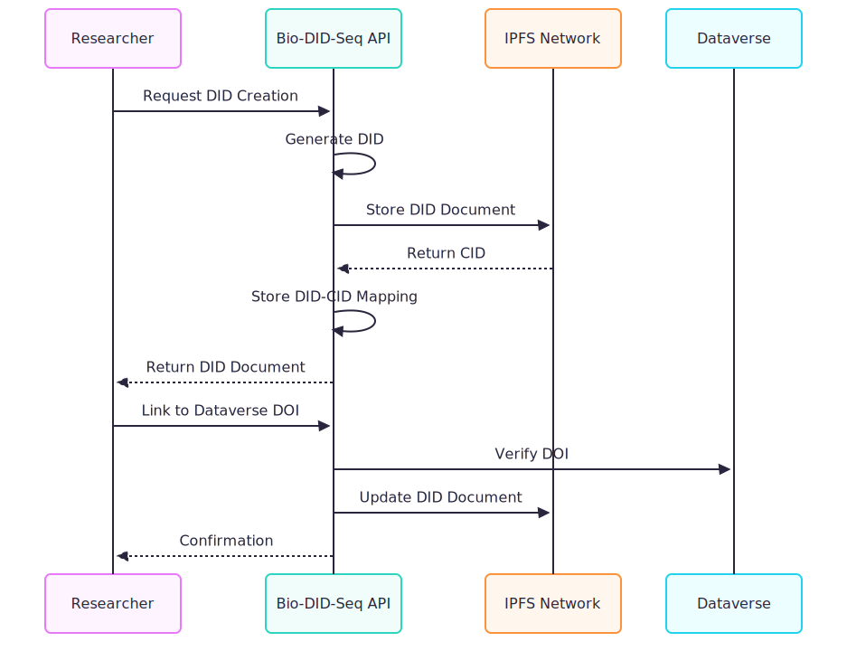
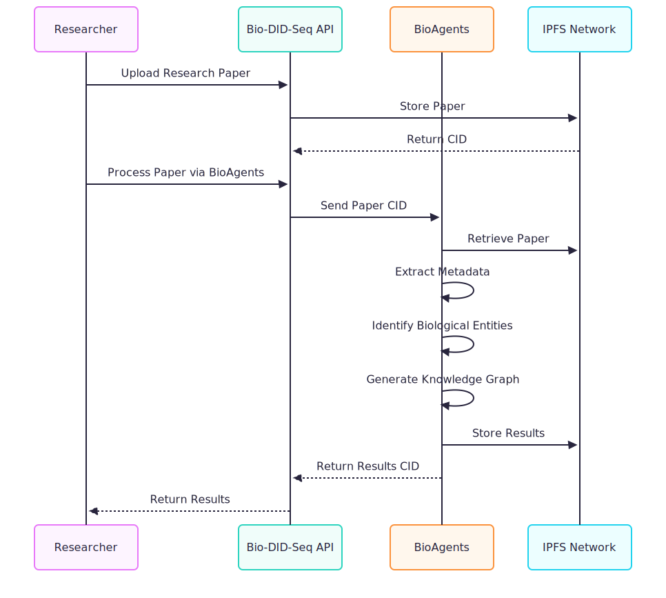
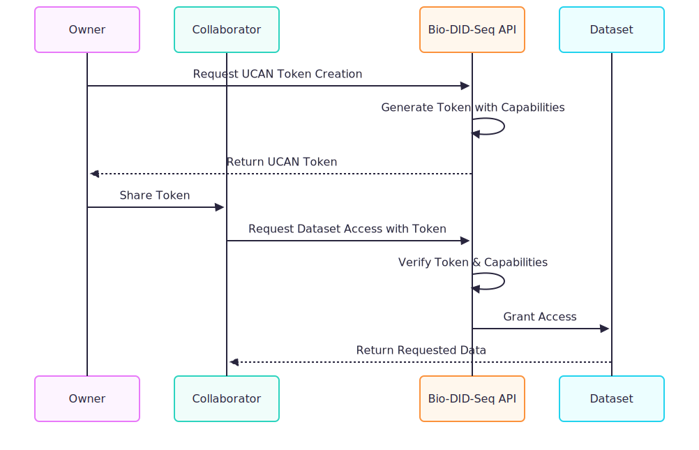

# Bio-DID-Sequencer

> Bio-DID-Seq is a GDPR compliant Decentralized Identifier (DID) system designed for research data, integrating with Dataverse and powered by AI agents.

## System Overview

Bio-DID-Seq provides a robust, decentralized approach to managing identifiers for research data. By implementing the W3C DID specification and integrating with existing persistent identifier infrastructures (like DOI and Handle), it offers a sustainable and user centric solution for the research community.



## Core Components

### 1. Layered Architecture

Bio-DID-Seq implements a 5 layer architecture:

#### Storage Layer
- **IPFS Cluster**: Provides redundant, decentralized storage for research data
- **Content Addressing**: All data is referenced by its cryptographic hash
- **Private IPFS Network**: Ensures data security while maintaining decentralization

#### Identity Layer
- **W3C DID Implementation**: Creates and manages decentralized identifiers
- **Dilithium5 Signatures**: Post quantum cryptographic security for DIDs
- **DID Resolution**: Resolves DID documents from the decentralized network

#### Authorization Layer
- **UCAN Integration**: User Controlled Authorization Network for capability based security
- **Delegated Permissions**: Allows controlled sharing of data access
- **GDPR Compliance**: Built in privacy controls and user data ownership

#### Application Layer
- **Actix Web API**: High performance web service endpoints
- **Async Processing**: Efficient handling of compute intensive operations
- **Rate Limiting**: Protection against abuse and DoS attacks

#### Integration Layer
- **BioAgents Connector**: Integration with AI powered data processing
- **Dataverse Adapter**: Seamless connection with Harvard Dataverse
- **DOI & Handle Bridge**: Interoperability with existing identifier systems

### 2. Key System Entities

#### DID Document
The core data structure representing a decentralized identifier for research data. Each DID document includes:

```json
{
  "@context": [
    "https://www.w3.org/ns/did/v1",
    "https://w3id.org/security/suites/ed25519-2020/v1",
    "https://w3id.org/biodata/v1"
  ],
  "id": "did:bio:123456789abcdefghi",
  "controller": ["did:key:z6MkhaXgBZDvotDkL5257faiztiGiC2QtKLGpbnnEGta2doK"],
  "verificationMethod": [
    {
      "id": "did:bio:123456789abcdefghi#keys-1",
      "type": "Ed25519VerificationKey2020",
      "controller": "did:bio:123456789abcdefghi",
      "publicKeyMultibase": "z6MkhaXgBZDvotDkL5257faiztiGiC2QtKLGpbnnEGta2doK"
    }
  ],
  "authentication": ["did:bio:123456789abcdefghi#keys-1"],
  "service": [
    {
      "id": "did:bio:123456789abcdefghi#storage",
      "type": "IPFSStorage",
      "serviceEndpoint": "https://ipfs.bio-did-seq.example/api"
    }
  ],
  "metadata": {
    "title": "CRISPR-Cas9 Gene Editing Dataset",
    "researchers": [
      {
        "name": "Jane Smith",
        "orcid": "0000-0001-2345-6789",
        "role": "Principal Investigator"
      }
    ],
    "keywords": ["CRISPR", "gene editing", "genomics"],
    "dataverse_link": "https://dataverse.harvard.edu/dataset.xhtml?persistentId=doi:10.7910/DVN/EXAMPLE"
  }
}
```

#### BioAgents
AI agents that provide enhanced functionality for biological data:

- **Metadata Extraction**: Automatically extracts metadata from research papers
- **Entity Recognition**: Identifies biological entities (genes, proteins, diseases)
- **Knowledge Graph Generation**: Creates semantic networks of biological relationships
- **Semantic Search**: Enables discovery across biological datasets

#### UCAN Token
Capability-based security tokens that provide decentralized authorization:

```json
{
  "header": {
    "alg": "EdDSA",
    "typ": "JWT"
  },
  "payload": {
    "iss": "did:key:z6MkhaXgBZDvotDkL5257faiztiGiC2QtKLGpbnnEGta2doK",
    "aud": "did:key:z6MkgYGF3tLg4MzGCLjkpkzYZqhrMkWGBMPXATFksYp1PxJh",
    "nbf": 1617228000,
    "exp": 1617314400,
    "att": [
      {
        "with": {"scheme": "did", "hierPart": "bio:123456789abcdefghi", "parameters": {}},
        "can": "biodata/read"
      }
    ]
  },
  "signature": "..."
}
```

## System Workflows

### 1. DID Creation and Registration



### 2. BioAgents Processing



### 3. UCAN Authorization Flow



## Technical Specifications

### API Endpoints

| Endpoint | Method | Description |
|----------|--------|-------------|
| `/api/did` | POST | Create a new DID |
| `/api/did/{id}` | GET | Retrieve a DID document |
| `/api/did/{id}` | PUT | Update a DID document |
| `/api/did/resolve/{id}` | GET | Resolve and validate a DID |
| `/api/did/dataverse/link` | POST | Link DID to Dataverse DOI |
| `/api/bioagents/process` | POST | Process paper via BioAgents |
| `/api/bioagents/status/{task_id}` | GET | Check processing status |
| `/api/bioagents/metadata/{task_id}` | GET | Get extracted metadata |
| `/api/bioagents/search` | GET | Search biological entities |
| `/api/bioagents/knowledge-graph/{cid}` | POST | Generate knowledge graph |
| `/api/dataverse/dataset` | POST | Create dataset in Dataverse |
| `/api/dataverse/dataset/file` | POST | Upload file to Dataverse |
| `/api/dataverse/dataset/publish` | POST | Publish dataset in Dataverse |

### Database Schema

```sql
-- DID Documents table
CREATE TABLE did_documents (
    id BIGINT PRIMARY KEY AUTO_INCREMENT,
    did VARCHAR(100) NOT NULL UNIQUE,
    cid VARCHAR(100) NOT NULL,
    user_id BIGINT NOT NULL,
    created_at TIMESTAMP NOT NULL,
    updated_at TIMESTAMP NOT NULL,
    dataverse_doi VARCHAR(255),
    FOREIGN KEY (user_id) REFERENCES users(id)
);

-- UCAN Tokens table
CREATE TABLE ucan_tokens (
    id BIGINT PRIMARY KEY AUTO_INCREMENT,
    user_id BIGINT NOT NULL,
    token TEXT NOT NULL,
    audience_did VARCHAR(255) NOT NULL,
    issued_at TIMESTAMP NOT NULL,
    expires_at TIMESTAMP NOT NULL,
    revoked BOOLEAN DEFAULT FALSE,
    revoked_at TIMESTAMP NULL,
    delegated_from VARCHAR(255) NULL,
    FOREIGN KEY (user_id) REFERENCES users(id)
);

-- BioAgents Processing Tasks
CREATE TABLE bioagent_tasks (
    id BIGINT PRIMARY KEY AUTO_INCREMENT,
    task_id VARCHAR(100) NOT NULL UNIQUE,
    user_id BIGINT NOT NULL,
    cid VARCHAR(100) NOT NULL,
    status VARCHAR(20) NOT NULL,
    progress FLOAT DEFAULT 0.0,
    result_cid VARCHAR(100),
    created_at TIMESTAMP NOT NULL,
    completed_at TIMESTAMP NULL,
    FOREIGN KEY (user_id) REFERENCES users(id)
);
```

## Security Considerations

### GDPR Compliance

The system is designed with privacy as a core principle:

- **Data Minimization**: Only essential data is collected
- **User Control**: Researchers maintain control over their data
- **Right to be Forgotten**: DIDs can be deactivated/deleted
- **Transparency**: Clear audit trails for data access
- **Consent Management**: Explicit permission required for data sharing

### Decentralized Security

Unlike traditional centralized systems:

- **No Single Point of Failure**: Distributed architecture
- **Capability Based Security**: Fine grained access control with UCAN
- **Tamper Evident Storage**: Content addressing ensures data integrity
- **Decentralized Identity**: No central authority for identity management

## Future Enhancements

1. **Enhanced AI Capabilities**: Expand BioAgents functionality with specialized models for different biological domains
2. **Federated UCAN Network**: Establish cross institutional trust networks for research collaboration
3. **Blockchain Anchoring**: Timestamp DID operations for non repudiation and audit trails
4. **Verifiable Credentials**: Implement W3C VCs for attesting research data properties
5. **Smart Contract Integration**: Programmatic data access control and licensing 