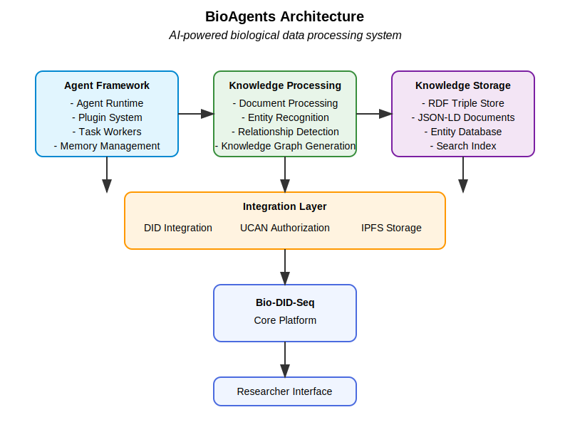
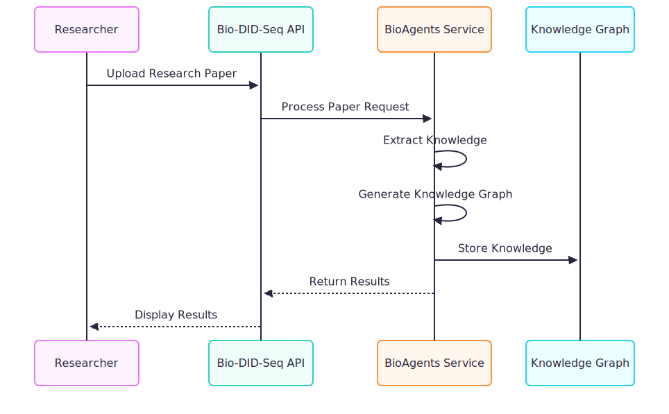
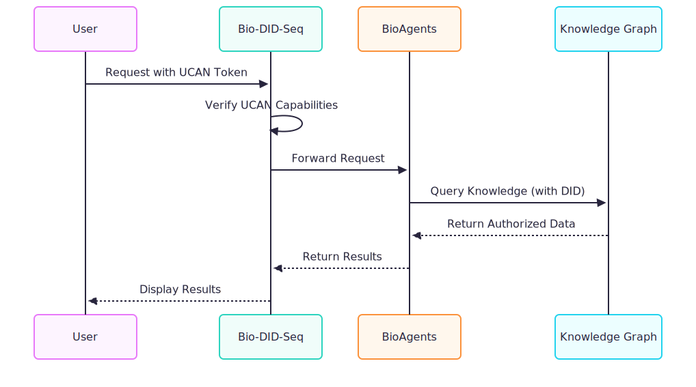

# BioAgents Architecture

> BioAgents is an AI powered system that processes research data, extracts metadata, identifies entities, and generates knowledge graphs to enhance data discoverability and usability.

## System Overview

BioAgents provides intelligent processing capabilities for research data within the Bio-DID-Seq ecosystem. It uses large language models (LLMs) and specialized AI agents to extract valuable information from research papers, identify entities, generate knowledge graphs, and enable natural language querying of research data.



## Core Components

### 1. Agent Framework

BioAgents is built on the Eliza OS agent framework which provides:

- **Agent Runtime**: Core execution environment for AI agents
- **Plugin System**: Extensible architecture for specialized capabilities
- **Memory Management**: Persistent storage of agent knowledge and states
- **Task Workers**: Async processing of compute intensive tasks

### 2. Knowledge Processing Pipeline

The BioAgents system processes research data through a multi stage pipeline:

#### Document Processing
- **PDF Extraction**: Extracts text and structure from PDFs using GROBID
- **Content Normalization**: Converts different formats to structured text
- **Section Identification**: Recognizes abstract, methods, results, etc.

#### Knowledge Extraction
- **Entity Recognition**: Identifies genes, proteins, diseases, compounds, etc.
- **Relationship Detection**: Finds connections between biological entities
- **Claim Extraction**: Identifies key scientific claims and evidence
- **Metadata Collection**: Authors, citations, publication details, etc.

#### Knowledge Representation
- **RDF Generation**: Converts extracted information to Resource Description Framework
- **JSON-LD Creation**: Structured, interoperable representation of knowledge
- **Knowledge Graph Integration**: Links new knowledge with existing data

### 3. Key System Components

#### BioAgents Service
The core service that provides biological intelligence capabilities:

```typescript
export class HypothesisService extends Service {
  static serviceType = "hypothesis";
  capabilityDescription = "Generate and judge hypotheses";
  // Service implementation...
}
```

#### DKG Plugin
Integrates with decentralized knowledge graphs:

```typescript
export const dkgPlugin: Plugin = {
  name: "dkg",
  description: "Agent DKG which allows you to store memories on the OriginTrail Decentralized Knowledge Graph",
  actions: [dkgInsert],
  providers: [],
  evaluators: [],
  services: [HypothesisService],
  routes: [health, gdriveWebhook, gdriveManualSync, totalAgents],
};
```

#### Knowledge Actions
Functions that process and store biological knowledge:

```typescript
export const dkgInsert: Action = {
  name: "INSERT_MEMORY_ACTION",
  description: "Create a memory on the OriginTrail Decentralized Knowledge Graph",
  // Implementation...
};
```

#### Anthropic Integration
Leverages Claude for advanced biological reasoning:

```typescript
async function updateGoTerms(data, client: Anthropic) {
  for (const entry of data) {
    const subjectResult = await searchGo(entry.subject, client);
    entry.subject = { term: entry.subject, id: subjectResult };
    // Processing logic...
  }
  return data;
}
```

## Integration with Bio-DID-Seq

BioAgents integrates with the Bio-DID-Seq system through several key pathways:

### 1. API Integration



### 2. DID based metadata management

Bio-DID-Seq respects and enforces the DID based decentralised metadata management model:



### 3. Data Processing Flow



## API Specifications

### BioAgents API Endpoints

| Endpoint | Method | Description |
|----------|--------|-------------|
| `/api/bioagents/process` | POST | Process a research paper |
| `/api/bioagents/status` | POST | Check processing status |
| `/api/bioagents/metadata` | POST | Get extracted metadata |
| `/api/bioagents/search` | POST | Search biological entities |
| `/api/bioagents/knowledge-graph` | POST | Generate knowledge graph |
| `/api/bioagents/query` | POST | Query using natural language |
| `/api/bioagents/knowledge` | POST | Add knowledge to the system |

### Request/Response Examples

#### Process Paper Request

```json
{
  "file_cid": "QmXg9Pp2ytZ14xgK35M6iTC2Vz6jR9zYgooNp2UHPTMnPN",
  "title": "CRISPR-Cas9 Gene Editing for Neurodegenerative Diseases",
  "authors": ["Jane Smith", "John Doe"],
  "doi": "10.1038/s41586-021-03819-2"
}
```

#### Process Paper Response

```json
{
  "task_id": "b8e5c9a4-2c7a-4d64-b4b3-7c01e2f8b54e",
  "status": "processing"
}
```

## Security and Privacy

BioAgents maintains the same security and privacy standards as the Bio-DID-Seq system:

1. **Authentication**: All API calls require valid authentication
2. **Authorization**: UCAN based capability model for granular permissions
3. **Data Encryption**: All data in transit and at rest is encrypted
4. **Audit Logging**: All data access is logged for compliance
5. **Privacy Controls**: Data processors follow GDPR principles

## Future Development

Planned enhancements for the BioAgents system include:

1. **Multi-Modal Processing**: Support for images, figures, and tables extraction
2. **Specialized Biological Models**: Domain specific AI models for different biological fields
3. **Real time Knowledge Updates**: Continuous learning from new research
4. **Federated Learning**: Privacy preserving distributed model training
5. **Hypothesis Generation**: AI assisted hypothesis formulation based on existing knowledge 