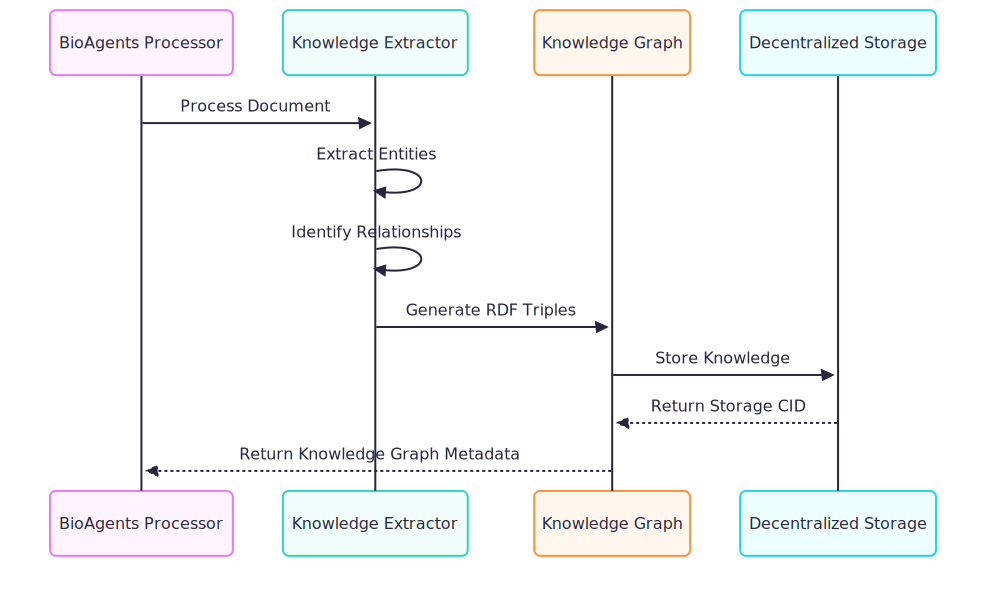

# Knowledge Graph Integration

> The Knowledge Graph integration enables rich, interconnected data representation across the Bio-DID-Seq and BioAgents ecosystem, supporting semantic queries and intelligent data discovery.

## Overview

Knowledge Graphs provide a powerful way to represent research data as interconnected entities and relationships rather than isolated documents. The Bio-DID-Seq platform leverages knowledge graphs to:

1. Enhance discoverability of research data
2. Connect related biological entities across datasets
3. Enable complex semantic queries
4. Support AI powered knowledge extraction and reasoning


## Knowledge Graph Architecture

### 1. Core Components

#### RDF Triple Store

The foundation of the knowledge graph is a Resource Description Framework (RDF) triple store that represents data as subject-predicate-object triples:

```turtle
# Example triple representation
<http://example.org/gene/BRCA1> <http://example.org/relation/associatedWith> <http://example.org/disease/BreastCancer> .
```

#### JSON-LD Documents

Knowledge is also represented in JSON-LD format for compatibility with web standards:

```json
{
  "@context": {
    "bio": "http://example.org/biology/",
    "schema": "http://schema.org/"
  },
  "@id": "bio:gene/BRCA1",
  "@type": "bio:Gene",
  "bio:name": "BRCA1",
  "bio:associatedWith": {
    "@id": "bio:disease/BreastCancer",
    "@type": "bio:Disease",
    "bio:name": "Breast Cancer"
  }
}
```

#### SPARQL Endpoint

A query interface allows complex semantic queries against the knowledge graph:

```sparql
PREFIX bio: <http://example.org/biology/>

SELECT ?gene ?disease WHERE {
  ?gene bio:associatedWith ?disease .
  ?disease a bio:Disease .
  ?disease bio:relatedTo bio:CancerPathway .
}
```

### 2. Integration Points



## Knowledge Extraction Process

### 1. Document Processing

BioAgents processes research papers to extract structured knowledge:

1. **Text Extraction**: Convert PDF documents to machine readable text
2. **Section Identification**: Identify abstract, methods, results, etc.
3. **Entity Recognition**: Identify genes, proteins, diseases, etc.
4. **Relationship Extraction**: Determine connections between entities

### 2. Knowledge Representation

Extracted knowledge is represented in a structured format:

```typescript
// Example of extracted biological relationships
interface BiologicalRelationship {
  subject: {
    term: string;
    id: string;
    type: "gene" | "protein" | "disease" | "pathway" | "compound";
  };
  // e.g., "inhibits", "activates", "associatedWith"
  predicate: string;
  object: {
    term: string;
    id: string;
    type: "gene" | "protein" | "disease" | "pathway" | "compound";
  };
  evidence: {
    text: string;
    source: string;
    confidence: number;
  };
}
```

### 3. Knowledge Graph Integration

Extracted knowledge is integrated into the knowledge graph:



## BioAgents Knowledge Graph Features

### 1. AI-Assisted Knowledge Enrichment

BioAgents enhances the knowledge graph through:

- **Context aware entity disambiguation**: Resolving ambiguous entity references
- **Missing relationship inference**: Inferring implicit connections
- **Cross Cross Platform DID Resolutionreference resolution**: Linking to external knowledge bases

### 2. Decentralized Knowledge Graph (DKG)

Integration with OriginTrail DKG provides:

```typescript
export const dkgInsert: Action = {
  name: "INSERT_MEMORY_ACTION",
  description: "Create a memory on the OriginTrail DKG",
  handler: async (runtime, message, state, options, callback) => {
    // DKG integration code
    const createAssetResult = await DkgClient.asset.create(
      { public: knowledgeAsset },
      { epochsNum: 12 }
    );
    
    return true;
  }
};
```

## Bio-DID-Seq Knowledge Graph Integration

### 1. DID-Based Knowledge Access

Each knowledge graph node can be associated with a DID:

```json
{
  "@context": [
    "https://www.w3.org/ns/did/v1",
    "https://w3id.org/biodata/v1"
  ],
  "id": "did:bio:123456789abcdefghi",
  "service": [
    {
      "id": "did:bio:123456789abcdefghi#kg",
      "type": "KnowledgeGraphService",
      "serviceEndpoint": "https://sparql.bio-did-seq.example/endpoint"
    }
  ],
  "knowledgeGraph": {
    "rootCID": "QmXg9Pp2ytZ14xgK35M6iTC2Vz6jR9zYgooNp2UHPTMnPN",
    "entityCount": 1457,
    "relationshipCount": 3892,
    "lastUpdated": "2025-06-17T14:23:45Z"
  }
}
```

### 2. UCAN-Based Authorization

Access to knowledge graph data is controlled through UCAN capabilities:

```json
{
  "header": {
    "alg": "EdDSA",
    "typ": "JWT"
  },
  "payload": {
    "iss": "did:key:z6MkhaXgBZDvotDkL5257faiztiGiC2QtKLGpbnnEGta2doK",
    "aud": "did:key:z6MkgYGF3tLg4MzGCLjkpkzYZqhrMkWGBMPXATFksYp1PxJh",
    "nbf": 1617228000,
    "exp": 1617314400,
    "att": [
      {
        "with": {"scheme": "did", "hierPart": "bio:123456789abcdefghi", "parameters": {}},
        "can": "kg/query"
      }
    ]
  },
  "signature": "..."
}
```

## Query Capabilities

### 1. Basic SPARQL Queries

Users can query the knowledge graph using SPARQL:

```sparql
PREFIX bio: <http://bio-ontology.org/>

SELECT ?gene ?diseaseName WHERE {
  ?gene bio:associatedWith ?disease .
  ?disease a bio:Disease ;
           bio:name ?diseaseName .
  FILTER(CONTAINS(?diseaseName, "Alzheimer"))
}
```

### 2. Natural Language Queries

BioAgents supports natural language queries that are translated to SPARQL:

```typescript
public async query_agents(query: string): Promise<(string, Vec<string>)> {
    // Natural language processing to SPARQL conversion
    // Query processing logic
    return (answer, sources);
}
```

Example query: "What genes are associated with Alzheimer's disease that also interact with the APOE pathway?"

## Use Cases

### 1. Knowledge Discovery

Researchers can discover hidden connections between biological entities and can enable delegation for specific Collaborators:



### 2. Hypothesis Generation

BioAgents can generate testable hypotheses based on knowledge graph patterns:

1. Identify gaps in the knowledge graph
2. Apply reasoning to suggest potential connections
3. Rank hypotheses by plausibility
4. Provide supporting evidence

### 3. Data Integration

The knowledge graph connects data across multiple sources:

- Research papers
- Experimental results
- External databases
- Clinical data
- Genomic information

## Future Developments

Upcoming enhancements to the knowledge graph integration include:

1. **Federated Queries**: Query across multiple knowledge graphs
2. **Temporal Knowledge Representation**: Track how knowledge evolves over time
3. **Uncertainty Representation**: Express confidence levels in relationships
4. **Reasoning Capabilities**: Advanced inference across the knowledge graph
5. **Multi Modal Knowledge**: Represent non textual data (images, etc.) 