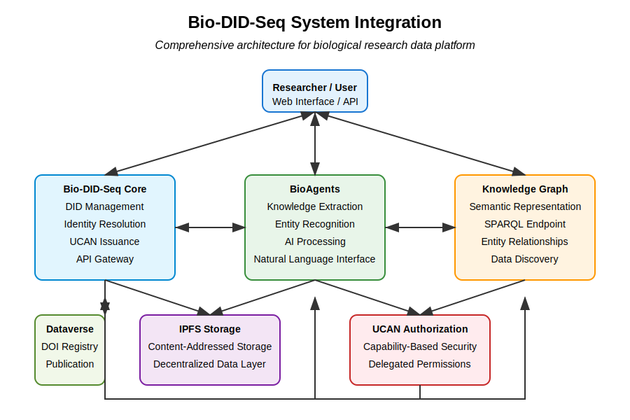
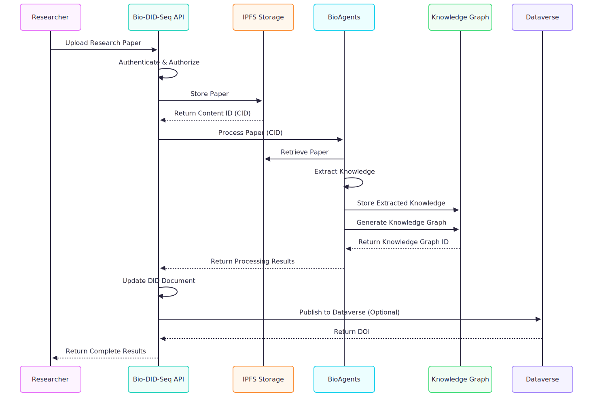
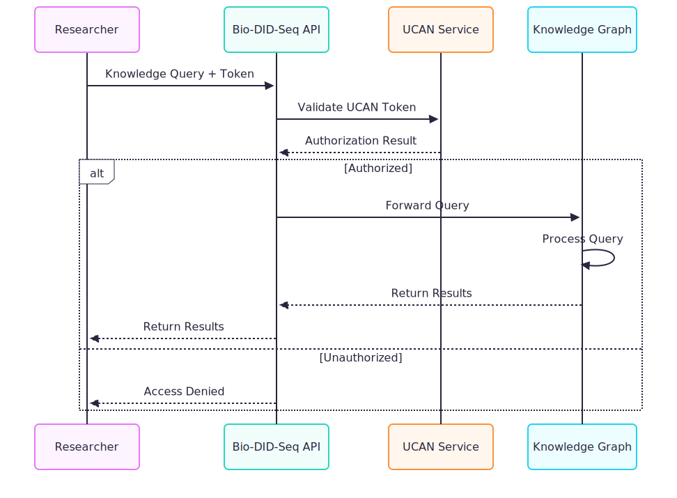
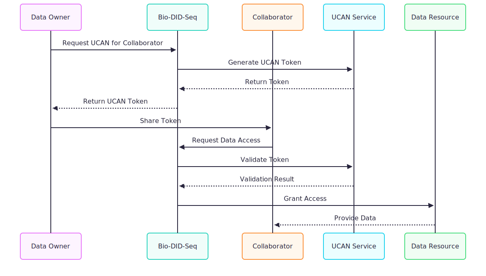
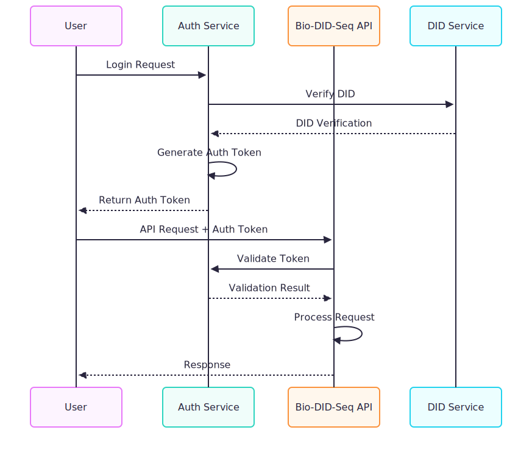

# System Architecture

> The Bio-DID-Seq ecosystem integrates multiple components including decentralized identifiers, AI powered processing, knowledge graphs, and secure data management to create a comprehensive platform for research data.

## Overview

The system integrates several key components to provide a seamless experience for researchers working with research data:

1. **Bio-DID-Seq Core**: The foundation providing decentralized identifiers and GDPR compliant data management
2. **BioAgents**: AI powered agents for research data processing and knowledge extraction
3. **Knowledge Graph**: Semantic representation of biological entities and relationships
4. **IPFS Storage Layer**: Decentralized and content addressed storage
5. **UCAN Authorization**: Capability based security model

This integration creates a powerful ecosystem that enhances data discoverability, ensures data sovereignty, and enables advanced biological insights.



## Core Component Interactions

### Integration Architecture



### Component Responsibilities

| Component | Primary Responsibility | Secondary Functions |
|-----------|------------------------|---------------------|
| Bio-DID-Seq Core | DID Management | Metadata Registry, UCAN Issuance |
| BioAgents | Knowledge Extraction | Entity Recognition, Relationship Detection |
| Knowledge Graph | Semantic Representation | SPARQL Queries, Data Discovery |
| IPFS Storage | Decentralized Data Storage | Content Addressing, Data Integrity |
| UCAN Service | Authorization & Access Control | Capability Delegation, Permission Management |

## System Integration Workflows

### 1. Research Paper Processing Workflow



### 2. Knowledge Query Workflow



### 3. UCAN Delegation Workflow



## Technical Integration Details

### 1. API Integration

The components interact through well-defined APIs:

```typescript
// Example API routes showing system integration
const apiRoutes = {
  // Bio-DID-Seq Core Routes
  "/api/did": "DID document management",
  "/api/auth": "Authentication & UCAN issuance",
  
  // BioAgents Integration Routes
  "/api/bioagents/process": "Process research papers",
  "/api/bioagents/query": "Natural language queries",
  
  // Knowledge Graph Routes
  "/api/kg/sparql": "SPARQL query endpoint",
  "/api/kg/search": "Semantic search interface",
  
  // Data Integration Routes
  "/api/dataverse": "Dataverse integration",
  "/api/ipfs": "IPFS storage operations"
};
```

### 2. Service Communication

Services communicate using a combination of:

- **REST APIs**: For synchronous operations
- **Event Bus**: For asynchronous workflows
- **WebSockets**: For real time updates
- **gRPC**: For high performance internal service communication

### 3. Data Format Standards

The system uses consistent data formats to ensure interoperability:

- **JSON-LD**: For semantic data representation
- **RDF**: For knowledge graph triples
- **DIDs**: W3C compliant decentralized identifiers
- **JWTs**: For authentication tokens
- **UCANs**: For authorization capabilities

## Security Integration

Security is integrated across all system components:

### 1. Authentication Flow



### 2. UCAN Authorization

UCAN tokens enable capability based security that integrates with the Bio-DID-Seq ecosystem:

```typescript
// Example of UCAN integration across services
async function validateCapability(ucanToken, requiredCapability, resourceId) {
  // Verify the UCAN token cryptographically
  const valid = await ucanService.verify(ucanToken);
  if (!valid) return false;
  
  // Check if the token has the required capability
  const hasCapability = await ucanService.hasCapability(
    ucanToken, 
    requiredCapability,
    resourceId
  );
  
  return hasCapability;
}
```

## Deployment Architecture

The integrated system is deployed using a microservices architecture:

### 1. Containerization

All components are containerized using Docker:

```yaml
# Example docker-compose.yml showing service integration
version: '3'
services:
  bio-did-seq:
    image: bio-did-seq:latest
    ports:
      - "8080:8080"
    depends_on:
      - db
      - ipfs
    environment:
      - BIOAGENTS_URL=http://bioagents:3000
      - KG_URL=http://knowledge-graph:8890
  
  bioagents:
    image: bioagents:latest
    ports:
      - "3000:3000"
    depends_on:
      - db
      - ipfs
    environment:
      - KG_URL=http://knowledge-graph:8890
      - DKG_URL=http://dkg:8900
  
  knowledge-graph:
    image: virtuoso:latest
    ports:
      - "8890:8890"
    volumes:
      - kg-data:/data
  
  ipfs:
    image: ipfs/kubo:latest
    ports:
      - "5001:5001"
    volumes:
      - ipfs-data:/data/ipfs

volumes:
  db-data:
  kg-data:
  ipfs-data:
```

### 2. Scalability

The architecture supports horizontal scaling of components:

- **API Gateways**: Load balanced entry points
- **Service Instances**: Multiple replicas for high demand services
- **Database Sharding**: For high volume data storage
- **IPFS Cluster**: Distributed storage across multiple nodes

## Cross-Cutting Concerns

Several aspects integrate across all components:

### 1. Logging and Monitoring

Unified logging and monitoring provide visibility across the system:

```typescript
// Example of integrated logging
class SystemLogger {
  static log(component, level, message, metadata) {
    // Add system-wide correlation IDs
    const enhancedMetadata = {
      ...metadata,
      component,
      timestamp: new Date().toISOString(),
      correlationId: getActiveCorrelationId()
    };
    
    // Log to centralized logging system
    logSystem.log(level, message, enhancedMetadata);
  }
}
```

### 2. Configuration Management

Centralized configuration ensures consistency across components:

```typescript
// Example of integrated configuration
class ConfigService {
  static async getConfig(component, key) {
    // Get from distributed configuration store
    return configStore.get(`${component}.${key}`);
  }
  
  static async setConfig(component, key, value) {
    // Update configuration and notify services
    await configStore.set(`${component}.${key}`, value);
    await eventBus.publish('config.updated', { component, key, value });
  }
}
```

## Future Integration Roadmap

The integration architecture supports future enhancements:

1. **Federated Knowledge Graphs**: Connect with external biological knowledge sources
2. **Advanced AI Integration**: Specialized biological AI models
3. **Blockchain Anchoring**: Timestamp proofs for research data provenance
4. **Cross Platform DID Resolution**: Broader DID method support
5. **Multi Modal Data Processing**: Support for images, molecular structures, etc.

## Integration Benefits

This tightly integrated architecture provides several advantages:

1. **Data Sovereignty**: Researchers maintain control of their data
2. **Enhanced Discoverability**: Knowledge graphs make data more findable
3. **Simplified Collaboration**: UCAN delegation enables secure sharing
4. **Reduced Integration Burden**: Standardized APIs and formats
5. **Future Proof Architecture**: Extensible and modular design 